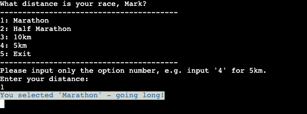
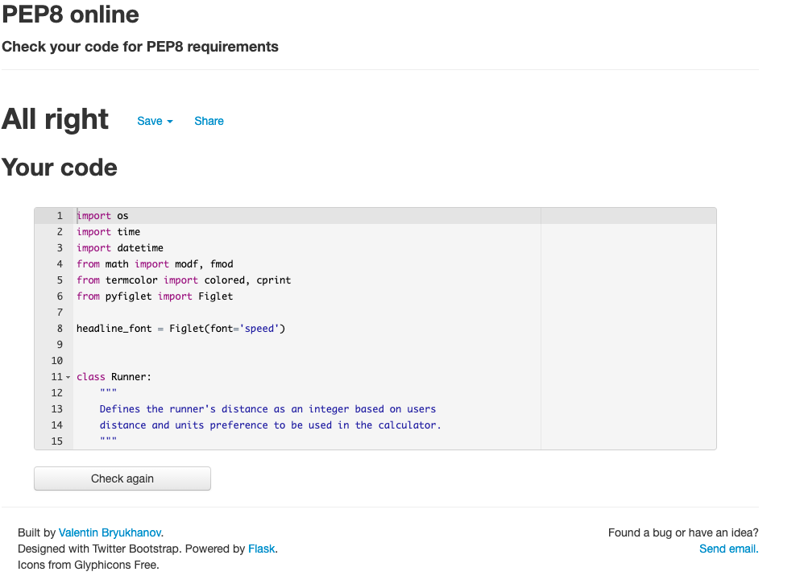

# RACE PACE

## By Mark Todman

The deployed [Race Pace](https://race-pace-marktodman.herokuapp.com/) app.

The [GitHub repository.](https://github.com/marktodman/race-pace)

---
## OVERVIEW

1. [Race Pace Concept](#Race-Pace-Concept)
1. [Planning](#Planning)
1. [How to use Race Pace](#How-to-use-Race-Pace)
1. [Testing](#Testing)
1. [Deployment](#Deployment)
1. [Future Development Ideas](#Future-development-ideas)
1. [Credits](#Credits)

## RACE PACE CONCEPT

Race Pace is an online application for calculating finish times in popular running race distances: Marathon, Half Marathon, 10km and 5km. Race Pace allows the user to calculate either the pace required to reach a target race finish time, or their race finish time if they run at a user-specified average pace. 

Race Pace will also provide split information to help guide the runner through their race. The split information is the times that the runner should be passing certain distance markers in their race. 

Race Pace will work in either kilometres or miles based on the user's preference.

### Target Audience:

- Runners who want to know how to pace their race to achieve a target finish time.
- Runners who want to know what their finish time will be if they run a particular pace in their race.
- Runners who want to improve their race times and race pacing.
- Coaches working with runners to improve their race times and race pacing.

---
## PLANNING

## User Stories

User stories were considered in the application design:

### First Time User

> *"As an experienced runner, I would like to know how fast I should run to achieve a target time at various race distances"*
>
> *"As a novice runner, I would like to know what finish time I will achieve based on my current training pace"*
>
> *"As a coach, I would like to calculate paces and finish times to help guide my runners in their races from beginner to expert level"*

### Returning User

> *"As a returning user, I would like to be able to change the race pace or target time"*
>
> *"I would like to change the race distance as my experience grows"*
>
> *"I would like to be able to see my previous records"*

### Developer

> *"As the app developer, I want to ensure a positive UX through defensive coding"*
> *"I want to guide the user through the app"*
> *"I want to produce accurate and meaningful output for the target audience"*

## Aims

The app aims to:
1. Provide clear instructions to guide the user without the need for further explanation from external sources.
1. Provide a clear and appropriate response to all user inputs.
1. Run without crashing due to an error caused by the user's input.
1. Provide the user with useful race pace information in a clear and helpful display.

## Objectives

To achieve the app aims:
1. Provide a welcome screen that introduces the app.
    * Personalise the user experience by requesting the user's first name.
1. Ensure that all user input provides an appropriate response.
1. Provide a menu of options where appropriate to reduce likely user error.
1. Ensure that clear instructions guide user input at each stage.
1. Provide clear error messages any time the user input is invalid and guide the user to input valid data.
1. Format text to identify user inputs, system outputs and error messages.

## Program Process Flow

The program process flow follows the following high-level steps:

---
## HOW TO USE RACE PACE

Users are guided through screens to generate the pacing information. Race Pace returns personalised information, so the first stage is for the user to input their first name.

The user selects their race distance: Marathon, Half Marathon, 10km, 5km. All calculations will be based on their selection.

The user selects their prefered units: kilometres or miles. All calculations will be based on their selection.

The user can then select whether they have a target finish time and would like to calculate the required pace to achieve the target. Or, whether they have a target pace and would like to know what finish time this would produce in their race.

Once this selection is made Race Pace calculates and returns the finish time and the pace, together with split times for given distance markers in the race.

---
## FEATURES

The app is designed to guide the user through the necessary steps to calculate their race pace to achieve their race goals. As the app is hosted in a terminal display, this has been centred on the page. A background image of runners provides context to the app. The RACE PACE title text (named 'speed' on [figlet.org](http://www.figlet.org/fontdb_example.cgi?font=speed.flf)) is coloured in white and green to emphasise that the app is designed for race pacing.

To personalise the UX, the first stage is for the user to input their first name. Only alpha characters are accepted and numbers or blanks will return an error.

The app provides feedback on each input so the user can see their input. This is especially useful in free text input. Text that the user has input is printed with blue text on a white background, The user has the chance to 'Restart' if they have made an error at any stage.

The app has selection menus to reduce user typograph error and enhance UX. Each menu contains user options that direct the user through a pathway to deliver a race pace, race time and race splits for their chosen distance. The menu options provide user choice and control, allowing defensive coding to protect the app and produce the desired output for the user. 'Exit' and 'Restart' options exist on each menu. 'Exit' closes the app. Once closed the user can restart by clicking the 'Start Race Button' which is always present on screen. 'Restart' starts the app from the beginning, allowing the user to enter a new name and continue through the menus from the start.

Only numbers 1 to 5 are accepted as valid input. Numbers outside of this range will generate an error message and the menu will reload. Alpha characters will also generate an error message and the menu will reload. This continues until the user inputs a number between 1 and 5. All error messages are printed in red text on a white background.

These error checks are coded into every menu selection. The user will not be allowed to advance until a valid input is made.

Once the user has selected their race distance, they are given a choice of whether they prefer to measure in kilometres or miles. This user selection is made once and then the chosen units are used for all calculations.

The user is then asked whether they have a target pace or target finish time for their race. This allows the user to choose to calculate the race splits and either finish time (based on pace) or necessary pace (based on target finish time).

At this point, the user goes onto their chosen path and are either asked to input their target race finish time or their target race pace.

The inputs for both target finish time and target pace are free text. The input must be in the format specified in the text. For the finish time, this must be H:MM:SS. For shorter distances, likely to be completed in less than one hour (e.g. 5km) the hour units must still be input. For the pace input, both MM:SS and M:SS formats can be input. Inputs not in these formats, or that do not represent a recognised time format will generate error messages. The request for input will continue until a valid input is input by the user.

Once the user has input either their target finish time or target pace, the app calculates either the race pace required to achieve the target finish time or the finish time based on the target pace. 

The display presents the output of the race finish time, race pace and split times for certain distances markers in the race. Outputs are printed in green text on a white background.

The user is then asked whether they would like to calculate another race pace. The choice will either restart the process at the distance selection page, retaining the user name or will exit the application.

---
## TESTING

Testing has been undertaken throughout the application development. As detailed in the 'Features' section above, testing for valid inputs was intrinsic to feature development.

### Testing of User Stories

The application was tested against all User Stories. The application met the objectives of the First Time User. The application met most of the objectives of the Returning User, although the ability to store and retrieve previously calculated race paces has not been included in this version. This is addressed in the 'Future Development Ideas' section below.

### Manual Testing

The app has been manually tested throughout development to ensure potential input variations gave the intended response. Manual testing has been undertaken on all variations for each distance including pace, time, miles and kilometres, which generates sixteen different combinations.

### PEP8 Testing and bug resolution

During the application development, the code was passed through a PEP8 linter. There were two main issues that required resolution:

1. Some lines of code exceed 80 characters. Solution: shorten code.
1. Bare except code. Solution: specify the error, which throughout this app is ValueError. This makes the app code more robust and means that only specific ValueError issues will be caught by the code.
1. Issue displaying time format when the returned answer started with zero. Solution: create an if statement to add a zero to the print string when the returned number was less than 10.

There are no remaining bugs.

### PEP8 Validation

The final Python code has passed through [PEP8 online](http://pep8online.com/checkresult) without any issues.

## HTML Validation

The final code has passed through the [W3C HTML Validation Service](https://validator.w3.org/nu/?doc=https%3A%2F%2Frace-pace-marktodman.herokuapp.com%2F) without any issues.

## CSS Validation

The final code has passed through the [W3C CSS Validation Service](https://jigsaw.w3.org/css-validator/validator?uri=https%3A%2F%2Frace-pace-marktodman.herokuapp.com%2F&profile=css3svg&usermedium=all&warning=1&vextwarning=&lang=en) without any issues.

---
## DEPLOYMENT

The Race Pace app is deployed via [GitHub](https://github.com/) and [Heroku](https://www.heroku.com/).

### GitHub Repository

The code is located in a [GitHub repository](https://github.com/marktodman/race-pace).

### Forking the GitHub Repository

To use this code and make changes without affecting the original code, it is possible to 'fork' the code on the GitHub repository through the following steps:

1. Create an account at [GitHub](https://github.com/).
1. Log into your GitHub account.
1. Go to the GitHub repository for [Race Pace](https://github.com/marktodman/race-pace).
1. Click the 'Fork' button in the upper right-hand corner of the page.
1. A copy of the repository will be available in your own repository.

### Heroku Deployment 

The site is deployed to [Heroku](https://www.heroku.com) through the following steps:
  
1. Log in to Heroku or create an account if required.
1. On the Welcome page click the button labelled 'New' in the top right corner, just below the header.
1. From the drop-down menu select 'Create new app'.
1. Enter a unique app name. 
1. Select the relevant geographical region.
1. Click to 'Create App'.
1. Navigate to 'Settings' and scroll down to the 'Config Vars' section. 
1. Click 'Reveal Config Vars' and enter 'PORT' for the key and '8000' for the value. Then click 'Add'.
1. Scroll down to the 'Buildpacks' section and click 'Add buildpack'.
1. Select 'python' and click 'Save Changes'.
1. Click 'Add buildpack'. Select 'nodejs'.
1. Check that 'python' is listed above 'nodejs'. This is critical for the app to deploy. If they are not in the correct order, click to drag 'python' to the top of the list.
1. Click on the 'Deploy' tab
1. Next to 'Deployment method' select 'GitHub'
1. Connect the relevant GitHub repository.
1. Under 'Manual deploy' choose the correct branch and click 'Deploy Branch'. 
1. Under 'Automatic deploys' you can select 'Automatic Deploys' so that the site updates when updates are pushed to GitHub.

---
## FUTURE DEVELOPMENT IDEAS

There is an opportunity to enhance the app. The main improvement would be the ability to store and/or download the final output. This could be achieved by adding a Google Sheet to store the final data for user reference.

---
## CREDITS

The deployment terminal is courtesy of [Code Institute](https://codeinstitute.net/).

[Corey Schafer's excellent YouTube Channel](https://www.youtube.com/c/Coreyms) provided some invaluable Python guidance.

The menu option code was built around information sourced at [computinglearner.com](https://computinglearner.com/how-to-create-a-menu-for-a-python-console-application/).

As always, Stack Overflow was a source of useful information including:
* [How to set a clear function for the terminal](https://stackoverflow.com/questions/517970/how-to-clear-the-interpreter-console/684344#684344)
* [How to split the float numbers on the decimal point](https://stackoverflow.com/questions/3454085/in-python-how-do-i-split-a-number-by-the-decimal-point)
* [How to validate time format](https://stackoverflow.com/questions/33076617/how-to-validate-time-format)

[Python.org](https://www.python.org/) was also useful, particularly with regard to [validating time inputs](https://docs.python.org/2/library/datetime.html#datetime.datetime.strptime).

[Jason Van Schooneveld](https://realpython.com/python-modulo-operator/#author) over at [realpython.com](https://realpython.com/) wrote a helpful article on the [modulo operator](https://realpython.com/python-modulo-operator/).

The background image is free to use courtesy of [Pexels](https://www.pexels.com/photo/crowd-of-male-and-female-runners-2402738/). Thank you to [RUN 4U FFWPU](https://www.pexels.com/@runffwpu) for taking and sharing the picture. The original image was edited by the author to produce the final version used in the site.

Chris Quinn as Mentor at the [Code Institute](https://codeinstitute.net/) provided excellent direction and helped with resources to steer this project to completion. Chris was particularly helpful in providing guidance on on the use of [fonts and color in Python](https://towardsdatascience.com/prettify-your-terminal-text-with-termcolor-and-pyfiglet-880de83fda6b), which in turn led to [Termcolor](https://pypi.org/project/termcolor/) and [Figlet](http://www.figlet.org/).

Thanks to the friends who gave feedback on the app.